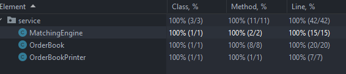
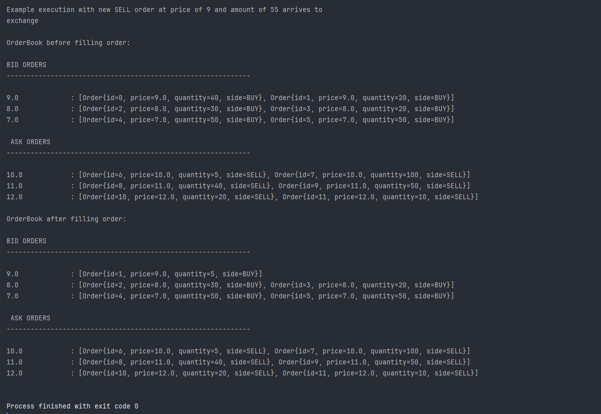

# Java Order Book Framework

## Overview
This project implements a simplistic **Order Book and Matching Engine** framework using **Java SE**. It provides functionality to manage and match orders in a trading system without relying on external frameworks, databases, or open-source libraries.

The project consists of the following components:
1. **OrderBook**: Handles storage and management of orders.
2. **MatchingEngine**: Matches buy and sell orders and updates the order book accordingly.
3. **Order Model**: Represents an individual order.
4. **Side Enum**: Represents the side of an order (BUY or SELL). 

The solution prioritizes efficiency and simplicity while adhering to the constraints provided in the assessment.

---

## Project Requirements
1. **Strictly JAVA SE Application**
    - No SpringBoot or other frameworks.
    - No database.
    - No front-end.
2. **No open-source libraries**: Only standard Java libraries are used during compile time scope. JUnit is the only external dependency and is only used for testing purposes
3. **Efficiency and Performance**: The code is designed for optimal efficiency in matching and order management with regards to the stated requirements.
4. **Test Cases**: Comprehensive unit tests are included. 
Please see below for test coverage  
<nl>

---

## Efficiency Mechanisms
### 1. **Data Structures**
- **LinkedHashMap**: Map\<Price, LinkedList of Order>:
    - Used to store orders grouped by price levels.
    - Maintains insertion order for easy traversal, ensuring that earlier orders at a given price level get matched first (FIFO).

- **LinkedList**: LinkedList\<Order>:
    - Stores individual orders at each price level.
    - Provides efficient removal of orders after matching and fast traversal.
    - Maintains insertion order to ensure FIFO
  
- **LinkedHashMap**: Map<Integer, Order>:
    - Used to store orders and their IDs for quick and efficient lookup of order without having to traverse the list or order with the same price 
    - Used to easily retrieve orders by ID which then is used to get the price and ensure quicker lookups for other order book operations.
    - Maintains insertion order to ensure FIFO

### 2. **Reasoning for Choices**
- **LinkedHashMap** allows efficient lookups and ensures predictable iteration order, which is crucial for prioritizing earlier orders.
Also has the following time complexities:
  - Insertion: O(1) average.
  - Deletion: O(1) average. 
  - Lookup by Price: O(1). 
- **LinkedList** is used at price levels because it supports fast insertion and removal, which are frequent operations in an order book. LinkedList implements the Deque<E> and Queue<E> which conforms to the requirement of how we want the orders to be added/processed.
Also has the following time complexities:
  - Insertion at End: O(1).
  - Deletion at Beginning: O(1). 
  - Iteration: O(n) for all elements at a price level. This is the most costly operation however with the FIFO implementation we do not expect iteration to be necessary during order fulfillment.
- The design minimizes the need for unnecessary data copying or complex algorithms, keeping operations efficient.

---

## Solution Approach
1. **OrderBook Management**:
    - Orders are added, deleted, or modified in the order book using efficient data structures.
    - Orders are grouped by price and side (BUY or SELL) to simplify matching.
2. **Matching Engine**:
    - Matches incoming orders with existing orders in the order book.
    - Partial and full matches are handled seamlessly.
    - Updates the order book after matching.
3. **Test Cases**:
    - JUnit 5 tests ensure that the implementation handles various scenarios such as full matches, partial matches, and edge cases like empty books.

---

## Class Descriptions

### 1. **Order**
Represents an individual order with attributes:
- `id`: Unique identifier.
- `price`: Price of the order.
- `quantity`: Quantity of the order.
- `side`: Side of the order (BUY or SELL).

### 2. **Side**
An enum representing the side of an order:
- `BUY`: Represents buy orders.
- `SELL`: Represents sell orders.

### 3. **OrderBook**
Handles storage and management of orders:
- **Operations**:
    - Add orders.
    - Delete orders.
    - Modify orders.
    - Retrieve orders by price and side.
    - Support FIFO for matching within a price level.

### 4. **MatchingEngine**
Matches buy and sell orders:
- Processes incoming orders to match them with existing orders.
- Handles partial fills and updates remaining quantities.
- Adds unmatched orders to the order book.

---

## Testing
The project includes comprehensive **JUnit 5** test cases:
1. **OrderBookTests**:
    - Test adding, deleting, and modifying orders.
    - Verify order retrieval by price and side.
2. **MatchingEngineTests**:
    - Test full and partial order matching.
    - Handle scenarios where no matches are found.
    - Verify correct updates to the order book.
---

## Why This Approach?
### Efficiency:
- By using **LinkedHashMap** and **LinkedList**, we achieve a balance between fast lookups and predictable iteration order for FIFO matching.

### Simplicity:
- The design avoids unnecessary complexity, making it easy to extend and maintain.

### Performance:
- The use of appropriate data structures ensures that operations like adding, deleting, and matching orders are efficient.

---

## Future Improvements
1. **DependencyInjection**:
    - Implement a dependency injection framework to achieve inversion of control and singleton scoped beans. For example, orderBook and matching engine.
2. **Concurrency Support**:
    - Add thread-safe mechanisms to support concurrent operations.
3. **Performance Metrics**:
    - Include logging or metrics to analyze performance under different workloads. log4j2/logback for logging and preferably something like Grafana and Prometheus to monitor performance.

---

## Program running with example data. ##
Using the below example:  
If a new sell order at price of 9 and amount of 55 arrives to
exchange, the matching engine should fully fill the bid at 9 with amount of 40 (at Amount 0) and partially fill
the bid at Amount 1 (15 is filled and 5 is remaining). The Order object should then be modified to contain
the correct amount after the partial fill.
 
I ran the above example in my program (setup in the Main class) and received the following results:  

 
One consideration with the above is that I assumed that **filling an order** is different to **modifying an order** hence why a filled order will retain its position in the queue
---

## Author
Anthony van Deventer

---

Feel free to reach out for further questions or clarifications!

